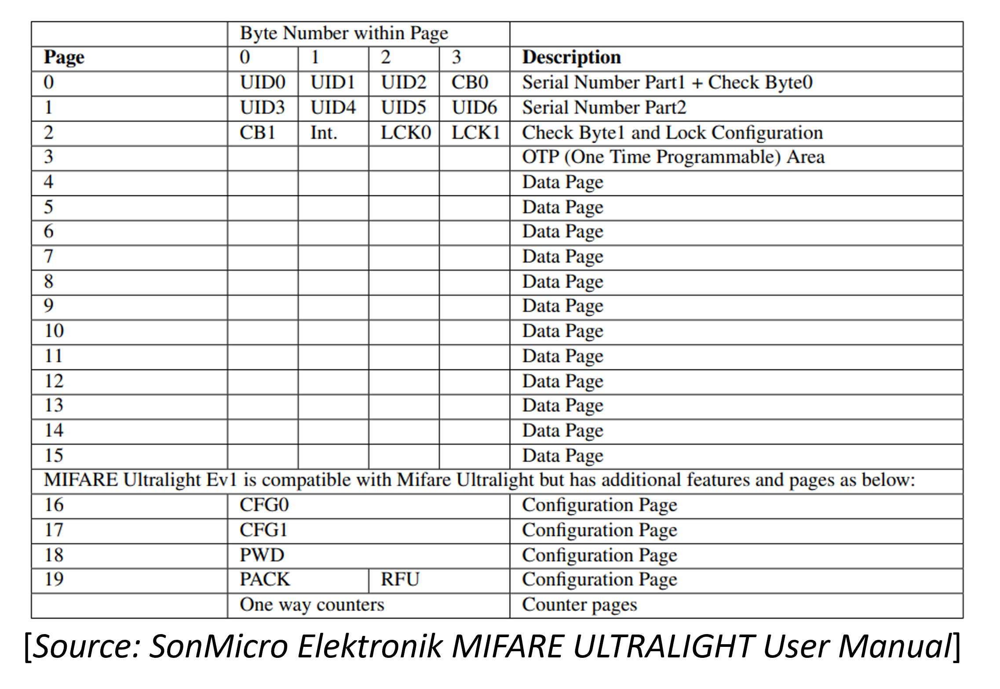
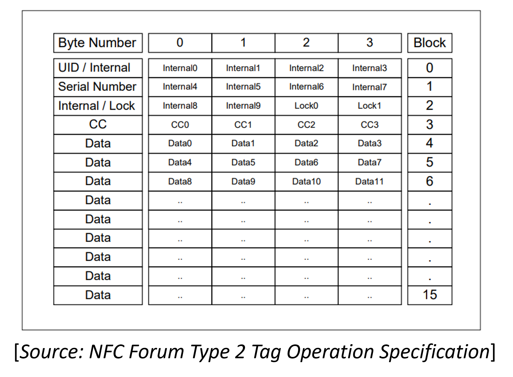

# Notes on Using PN532 on RPI and NDEF
The first section of this document describes how to use the PN532 RFID NFC module with Raspberry Pi. In the second section the basic steps required for preparing a Mifare Ultralight card for storing NDEF records are provided.


## Setting up PN532 on RPI
This section briefly covers the setup of the PN532 RFID NFC module with Raspberry Pi. The module is connected to the Raspberry Pi via I2C and controlled via [libnfc](https://github.com/nfc-tools/libnfc).

### Connect PN532 module
> :warning: In case the used PN532 module offers multiple interfaces ensure that it is configured (check for jumpers/switches) for I2C.

Connect the I2C pins to the following physical pins on the Raspberry Pi.
 * GND -> 6
 * VCC -> 4
 * SDA -> 3
 * SCL -> 5

*Note on Raspberry Pi [pin numbering](https://www.raspberrypi.com/documentation/computers/raspberry-pi.html#gpio-and-the-40-pin-header):*
```
---------------------------
| 2 4 6 8                 | Header
| 1 3 5 7 ...             |
---------------------------
|                         | Remaining board
|                         |
|     Raspberry Pi        |
|                         |
|--------------------------
```

### Setup Raspberry Pi
#### Enable I2C Interface
Use the Raspberry Pi configuration tool called [`raspi-config`](https://www.raspberrypi.com/documentation/computers/configuration.html) to enable the I2C interface.
```
sudo raspi-config nonint do_i2c 0
```

Optional, check if the PN532 module is available on the I2C bus. Use `i2cdetect` from the *i2c-tools* package to scan the I2C bus for devices.
```
sudo apt update
sudo apt install i2c-tools

i2cdetect -y 1 #scan bus 1 for devices
```
Example output (device found at addr 24)
```
     0  1  2  3  4  5  6  7  8  9  a  b  c  d  e  f
00:                         -- -- -- -- -- -- -- --
10: -- -- -- -- -- -- -- -- -- -- -- -- -- -- -- --
20: -- -- -- -- 24 -- -- -- -- -- -- -- -- -- -- --
30: -- -- -- -- -- -- -- -- -- -- -- -- -- -- -- --
40: -- -- -- -- -- -- -- -- -- -- -- -- -- -- -- --
50: -- -- -- -- -- -- -- -- -- -- -- -- -- -- -- --
60: -- -- -- -- -- -- -- -- -- -- -- -- -- -- -- --
70: -- -- -- -- -- -- -- --
```
In case the module ist not found use `i2cdetect -l` to list available I2C buses and scan them for devices by changing the bus number passed to `i2cdetect`([see man page](https://www.unix.com/man-page/centos/8/i2cdetect/)).


#### Install and configure libnfc
Install latest version of libnfc from repo.
```
sudo apt update
sudo apt install libnfc6 libnfc-bin libnfc-examples
```

Add config for the PN532 module to libnfc (assumes that module is connected to bus 1, if not change */dev/i2c-1* accordingly).
```
sudo mkdir -p /etc/nfc/devices.d
printf 'name = "pn532"\nconnstring = "pn532_i2c:/dev/i2c-1"\n' | sudo tee /etc/nfc/devices.d/pn532.conf
```

Poll NFC tag to check if libnfc is fuctional.
```
nfc-poll
```

## Store NDEF data on Mifare Ultralight cards
This section briefly outlines the steps required to prepare a blank Mifare Ultralight card as a NFC Forum Type 2 Tag for storing NDEF records and shows how to store a URL in a NDEF record. 

### Prepare Mifare Ultralight for NDEF
Blank Mifare Ultralight cards ship with an empty one time programmable (OTP) area located in block/page 3. The NFC Forum Type 2 Tag Operation Specification puts the Capability Container (CC) used for managing information on the tag at this block. To initialize the card the CC must be written.

<details>
  <summary><b>Mifare Ultralight layout</b></summary>

  [SonMicro Elektronik MIFARE ULTRALIGHT User Manual](https://shop.sonmicro.com/Downloads/MIFAREULTRALIGHT-UM.pdf)
     
</details>


<details>
  <summary><b>NFC Forum Type 2 Tag layout</b></summary>

  [NFC Forum Type 2 Tag Operation Specification](https://blog.eletrogate.com/wp-content/uploads/2018/05/NFCForum-TS-Type-2-Tag_1.1.pdf)
     
</details>


> :warning: **You only have one shot** - As the name suggest the OTP can only be written once. Therefore, extrem care should be taken when writting the CC. Otherwise you may end up with a broken card.

Get a dump of the blank Mifare Ultralight card.


